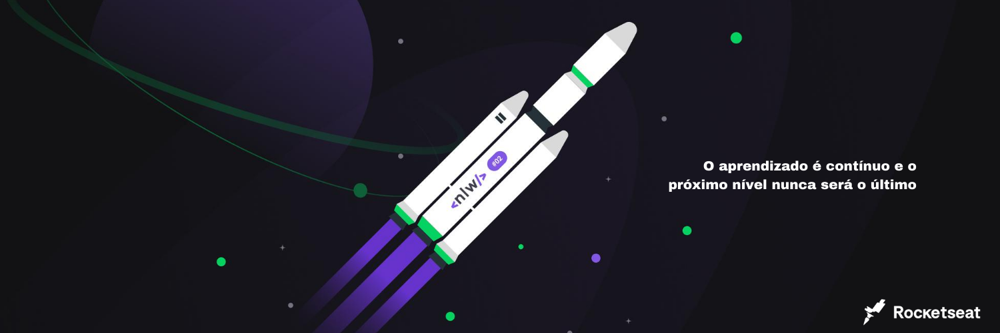
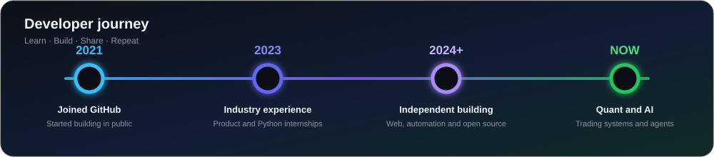
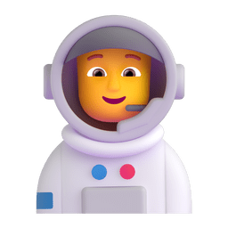
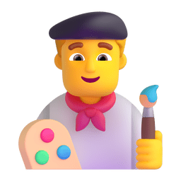
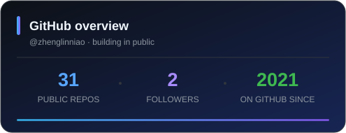
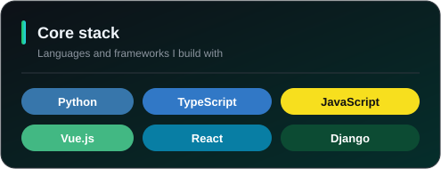

  

  <picture>
    <source media="(prefers-color-scheme: dark)" srcset="./assets/images/coding.gif" />
    <source media="(prefers-color-scheme: light)" srcset="./assets/images/developer.svg" />
    
  </picture>

  

    
    
    
    
    
  

  
<strong>用代码解决真实问题，也用镜头记录沿途的世界。</strong>

## 🙋 About me

<table>
  <tr>
    <td width="72%">
      
嗨，我是 <strong>Kid</strong>，一名热爱技术与创造的开发者。

      <ul>
        <li>💻 热爱计算机科学与互联网技术，关注代码质量与工程实践</li>
        <li>🐍 使用 Python 构建可靠、实用的软件</li>
        <li>🌐 持续探索现代 Web 开发与前后端协作</li>
        <li>🌱 保持好奇，持续学习，也乐于把想法变成作品</li>
        <li>📷 编程之外，喜欢摄影、阅读和旅行</li>
      </ul>
      <blockquote>We're making the world a little better—one thoughtful line of code at a time.</blockquote>
    </td>
    <td width="28%" align="center">
      
    </td>
  </tr>
</table>

## 🧰 Tech stack

  <h4>Languages & Frameworks</h4>

  

    
    
    
    
    
    
    
    
  

  <h4>Tools & Environment</h4>

  

    
    
    
    
  

  

## 🎯 Current focus

<table>
  <tr>
    <td align="center" width="25%">
       
      <strong>量化系统</strong> 
      策略、回测与交易自动化
    </td>
    <td align="center" width="25%">
       
      <strong>AI Agents</strong> 
      LangGraph 与智能工作流
    </td>
    <td align="center" width="25%">
       
      <strong>产品工程</strong> 
      从想法到可用产品
    </td>
    <td align="center" width="25%">
       
      <strong>开源学习</strong> 
      阅读、实践与持续分享
    </td>
  </tr>
</table>

## 🏢 Experience

<table>
  <thead>
    <tr>
      <th>时间</th>
      <th>公司</th>
      <th>岗位</th>
    </tr>
  </thead>
  <tbody>
    <tr>
      <td>2023.07 — 2024.01</td>
      <td><a href="https://datagrand.com/">北京达观数据有限公司</a></td>
      <td>Python 工程师（实习）</td>
    </tr>
    <tr>
      <td>2023.03 — 2023.06</td>
      <td><a href="https://www.dewu.com/">上海识装信息科技有限公司（得物 App）</a></td>
      <td>开发实习生</td>
    </tr>
  </tbody>
</table>

  

## 🌏 Beyond code

<table>
  <tr>
    <td align="center" width="33%">
       
      <strong>旅行</strong> 
      去看不同的城市，也去理解不同的生活。
    </td>
    <td align="center" width="33%">
       
      <strong>摄影</strong> 
      用镜头保存光影、情绪与故事。
    </td>
    <td align="center" width="33%">
       
      <strong>阅读</strong> 
      从书里认识世界，也重新认识自己。
    </td>
  </tr>
</table>

## 🔗 Find me online

<table>
  <tr>
    <td width="33%" align="center" valign="top">
      <h3>🧭 Project Hub</h3>
      
集中展示正在构建和持续迭代的项目。

      <a href="https://easy-to-learn-steel.vercel.app/"><strong>访问项目主页 →</strong></a>
    </td>
    <td width="33%" align="center" valign="top">
      <h3>✍️ Personal Blog</h3>
      
记录技术学习、开发实践与生活思考。

      <a href="https://web.zlnblog.asia/"><strong>阅读博客 →</strong></a>
    </td>
    <td width="33%" align="center" valign="top">
      <h3>🌱 Gitee</h3>
      
查看国内代码托管平台上的项目与镜像。

      <a href="https://gitee.com/zheng-linniao"><strong>访问 Gitee →</strong></a>
    </td>
  </tr>
</table>

## 📊 GitHub dashboard

  
  

   

  <picture>
    <source media="(prefers-color-scheme: dark)" srcset="https://streak-stats.demolab.com?user=zhenglinniao&theme=github-dark-blue&hide_border=true&locale=zh_Hans" />
    <source media="(prefers-color-scheme: light)" srcset="https://streak-stats.demolab.com?user=zhenglinniao&theme=default&hide_border=true&locale=zh_Hans" />
    
  </picture>

## 🚀 Featured projects

<table>
  <tr>
    <td width="50%" valign="top">
      <h3><a href="https://github.com/zhenglinniao/Quant_binance">📈 Quant_binance</a></h3>
      
面向 Binance 的量化交易平台，包含趋势跟踪、网格交易，以及模拟盘与实盘运行模式。

      <code>Python</code> <code>Quant Trading</code>
    </td>
    <td width="50%" valign="top">
      <h3><a href="https://github.com/zhenglinniao/Cryptocurrency-Monitoring">🪙 Cryptocurrency Monitoring</a></h3>
      
用于分析加密市场的专业级情报与可视化仪表盘。

      <code>TypeScript</code> <code>Dashboard</code>
    </td>
  </tr>
  <tr>
    <td width="50%" valign="top">
      <h3><a href="https://github.com/zhenglinniao/langgraph_agent">🤖 LangGraph Agent</a></h3>
      
生成式人工智能代理的学习、开发与实现。

      <code>Jupyter Notebook</code> <code>AI Agent</code>
    </td>
    <td width="50%" valign="top">
      <h3><a href="https://github.com/zhenglinniao/vibe-coding-cn">✨ Vibe Coding CN</a></h3>
      
开发经验、中文资料与提示词库组成的 Vibe Coding 工作站。

      <code>Python</code> <code>Prompt Library</code>
    </td>
  </tr>
  <tr>
    <td width="50%" valign="top">
      <h3><a href="https://github.com/zhenglinniao/translationcode_jupyter">🌐 Translation Code Jupyter</a></h3>
      
使用 LLM Agent 辅助翻译英文 Notebook，让学习资料更容易阅读。

      <code>Jupyter Notebook</code> <code>LLM</code>
    </td>
    <td width="50%" valign="top">
      <h3><a href="https://github.com/zhenglinniao/-demo">💬 Multi-user Chat Demo</a></h3>
      
支持多用户、多轮问答、群组对话与 AI 模拟回复的聊天服务。

      <code>Python</code> <code>FastAPI</code>
    </td>
  </tr>
</table>

## 🧭 How I build

<table>
  <tr>
    <td width="33%" valign="top">
      <h3>01 · Make it useful</h3>
      
先解决真实问题，再逐步打磨体验与边界。

    </td>
    <td width="33%" valign="top">
      <h3>02 · Make it clear</h3>
      
偏爱清晰的结构、可读的代码和可维护的设计。

    </td>
    <td width="33%" valign="top">
      <h3>03 · Make it better</h3>
      
通过反馈与复盘持续迭代，让每个版本都更进一步。

    </td>
  </tr>
</table>

## 💬 A little inspiration

  <h3>“The best way to predict the future is to invent it.”</h3>
  
<em>— Alan Kay</em>

  

  <h3>Keep learning · Keep building · Keep exploring</h3>
  感谢你的访问，愿我们都能持续创造有价值的东西。

